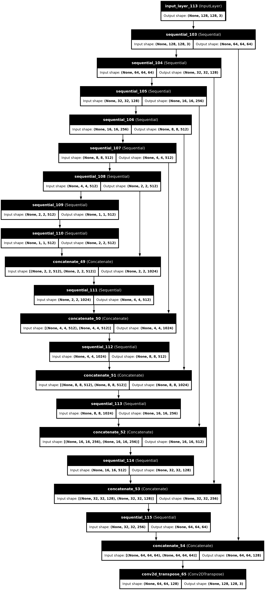
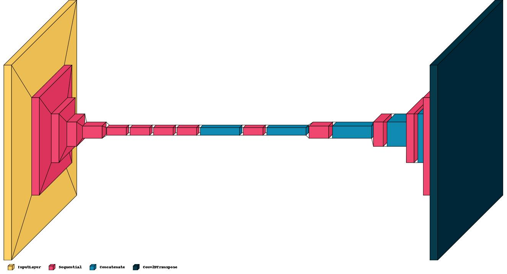
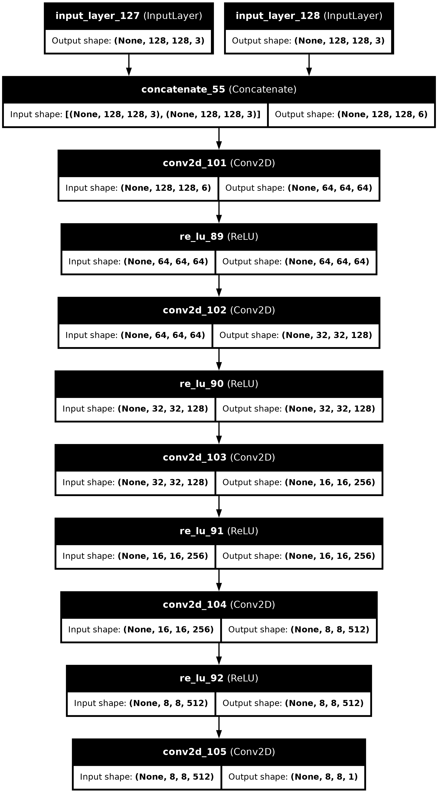
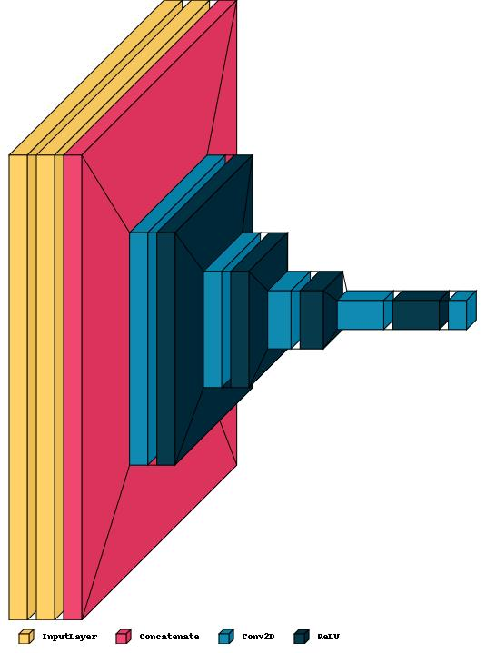
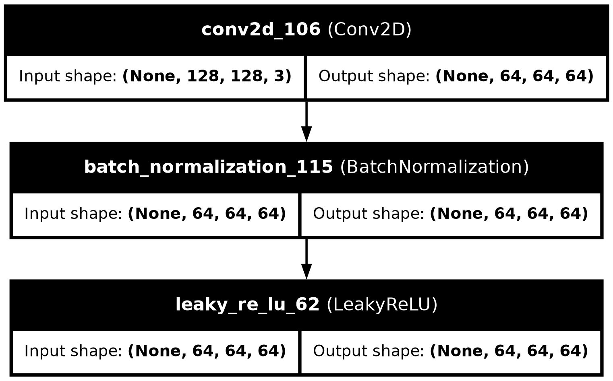
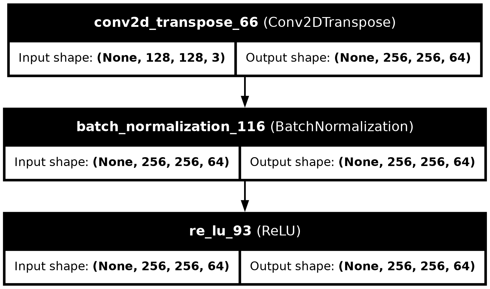

# SAR Image Colorization for Comprehensive Insight using Deep Learning

## Problem Statement

**Problem ID:** 1733  
**Title:** SAR Image Colorization for Comprehensive Insight using Deep Learning Model (h)  
**Organization:** Indian Space Research Organization (ISRO)  
**Department:** Space Technology  
**Category:** Software  
**Theme:** Space Technology

### Description:
Synthetic Aperture Radar (SAR) imagery is rich in structural and textural information but lacks the intuitive appeal of color, which can provide more comprehensive insights for space-borne applications. SAR image colorization using Deep Learning (DL) models offers a transformative approach for enhancing the interpretability of monochromatic SAR image data.

This project aims to develop an innovative solution to colorize grayscale SAR images for enhanced interpretation and analysis of feature targets. A novel DL model is to be designed and trained using pairs of SAR and Optical images. The goal is to minimize the loss function that captures the difference between the predicted and actual color images.

### Challenge:
The project poses several challenges requiring innovative approaches in data preprocessing, model design, and evaluation methodologies. The DL system should accurately predict and apply colors to SAR images, making surface features more distinguishable and interpretable.

### Usage:
The main goal is to improve the usability of SAR data in various applications like geological studies and environmental monitoring by providing more intuitive and informative visual representations.

### Users:
Remote Sensing Image Analysts

### Available Solutions:
While existing Deep Learning models have been proposed, they don't meet the desired performance criteria for SAR image colorization, necessitating the development of a more effective solution.

### Desired Outcome:
The project aims to deliver a DL-based SAR Image Colorization software for better analysis and interpretation of SAR imagery.

---

## Repository Structure

This repository contains the following files:

1. **`GANs Generator Discriminator.ipynb`**: This notebook is used for training and downloading models. It contains both the generator and discriminator models for the SAR image colorization task.
2. **`test.py`**: This script is used to generate output images from user-provided grayscale SAR images using the trained models.

Additionally, the repository contains a **`data/`** folder that includes images to illustrate the architectures of the generator, discriminator, and sample downsampling/upsampling functions.

---

## Model Design

### Generator

The generator model is based on an efficient version of **pix2pix** to handle RAM and training issues. Below is a brief description of the generator architecture:

- **Downsample layers**: These layers reduce the spatial dimensions of the input image while increasing the number of feature maps.
- **Upsample layers**: These layers increase the spatial dimensions of the feature maps while reducing the depth.

Here is an example of how the generator architecture looks:



Additionally, a visual representation of the generator using **Visual Keras** can be found below:



### Discriminator

The discriminator compares the real color image with the generated one. It learns to distinguish between actual colorized images and those generated by the model, improving the overall accuracy of the system.

Below is the visual representation of the discriminator:



And here is another view using **Visual Keras**:



---

## Model Functions

### Downsampling
The downsampling function reduces the spatial dimensions of the image during the encoding phase of the generator. It uses convolutional layers, followed by batch normalization and LeakyReLU activation.



### Upsampling
The upsampling function is the reverse operation, which restores the spatial dimensions in the decoding phase using transposed convolutions, followed by batch normalization and ReLU activation.



---

## Loss Functions

The following loss functions are implemented to train the GAN model:

### Generator Loss
The generator loss is a combination of **GAN loss** and **L1 loss**. GAN loss ensures the generator produces realistic images, while L1 loss minimizes the pixel-wise difference between the predicted and actual images.

```python
def generator_loss(disc_generated_output, target, gen_output):
    gan_loss = tf.reduce_mean(
        tf.keras.losses.BinaryCrossentropy(from_logits=True)(
            tf.ones_like(disc_generated_output), disc_generated_output
        )
    )
    
    l1_loss = tf.reduce_mean(
        tf.keras.losses.MeanAbsoluteError()(target, gen_output)
    )
    
    total_gen_loss = gan_loss + 100 * l1_loss
    return total_gen_loss, gan_loss, l1_loss
```

### Discriminator Loss
The discriminator loss ensures that the discriminator correctly distinguishes between real and generated images. It calculates the difference between real and generated images using binary cross-entropy.

```python
def discriminator_loss(disc_real_output, disc_generated_output):
    real_loss = tf.reduce_mean(tf.keras.losses.BinaryCrossentropy(from_logits=True)(tf.ones_like(disc_real_output), disc_real_output))
    generated_loss = tf.reduce_mean(tf.keras.losses.BinaryCrossentropy(from_logits=True)(tf.zeros_like(disc_generated_output), disc_generated_output))
    return real_loss + generated_loss
```

## Downloading Models

[Drive Link to Download Generator and Discriminator Models](https://drive.google.com/drive/folders/1_iCZH2zK-BiPGLRQACQRQvFdNj8mkapP?usp=sharing)

## Usage

### Training the Model
To train the model, use the notebook file `GANs Generator Discriminator.ipynb`. This file contains the code for loading datasets, preprocessing, training the model, and saving the weights. Ensure all necessary libraries are installed by running:

### Libraries Required
The libraries required to run `test.py` file is mentioned in `requirements.txt` file.
You may use the following command to install all the necessary libraries.

```bash
pip install -r requirements.txt
```